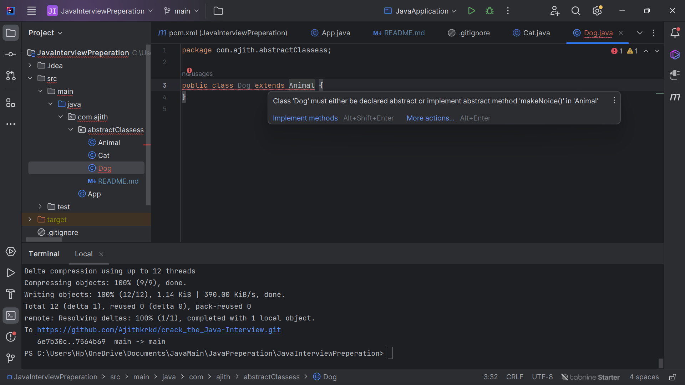

# What is Abstract classes


````
**Question:** 
What is Abstract classes ?
````
- In JAVA , abstract classes that canot be instantiated if we want to use their methods and properties we want to extend
- Abstract classes are declared using abstract keyword .
- Abstract classes contains abstract methods and and concrete methods.
- If we created a abstract method it does not have body only have declaration.
- If we declared any abstract methods in the abstract class we must impliment the method in the extended subclass.

````
Why we need a class which can't be instantiated , what is the advantage of abstract class?
````
- Using abstract classes we can define a template that must follow the inherited subclasses,for example

if we have a class Animal that have a method called makeNoice() , every animal make noice in defrent types so  i created a abstract method makeNoice
the subclasses must need to implement , I created two subclasses CAT , DOG  both of the subclasses have it own implementation deffrent noice sound but both animal must have to include this method
other wise it will show compail time error 

